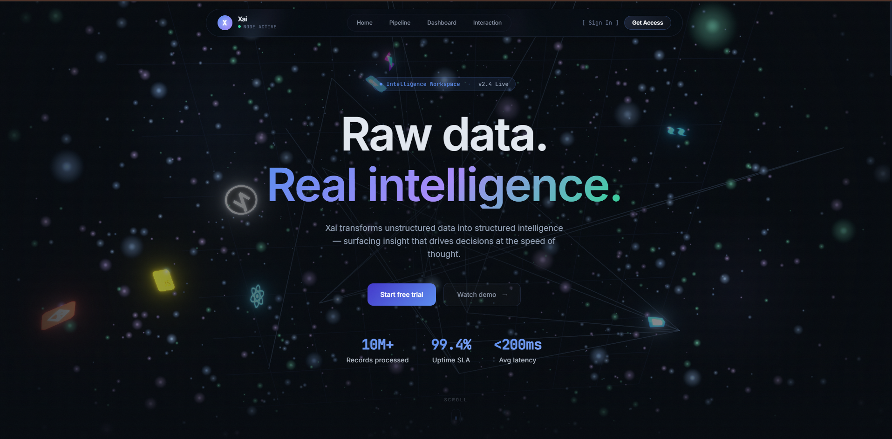
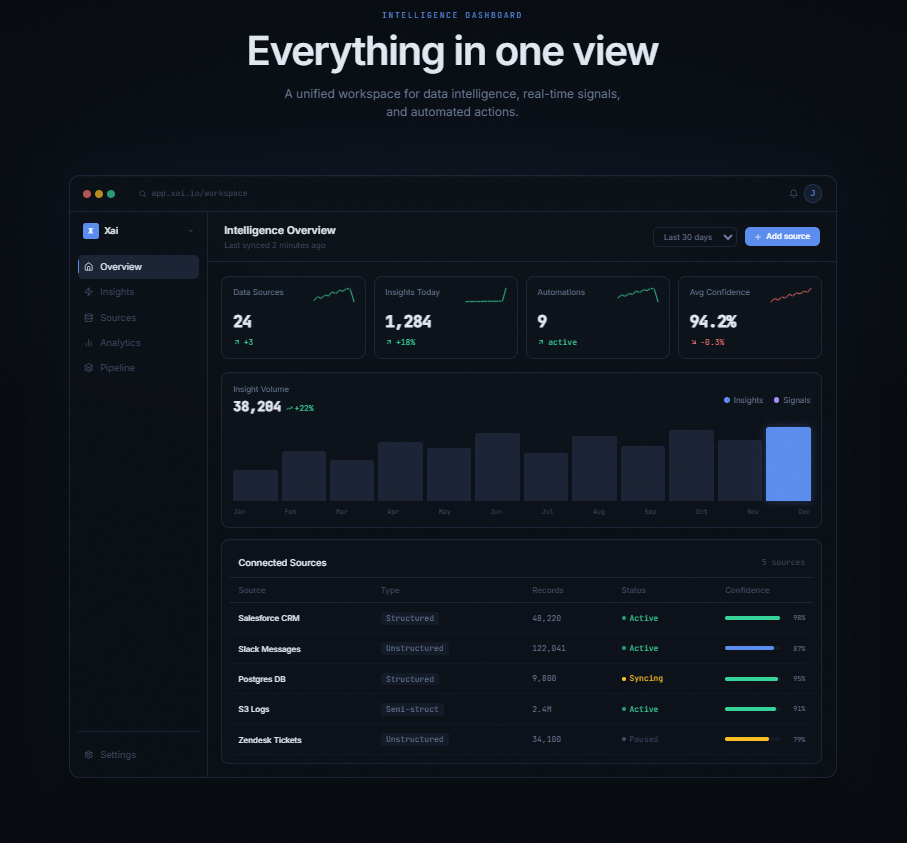
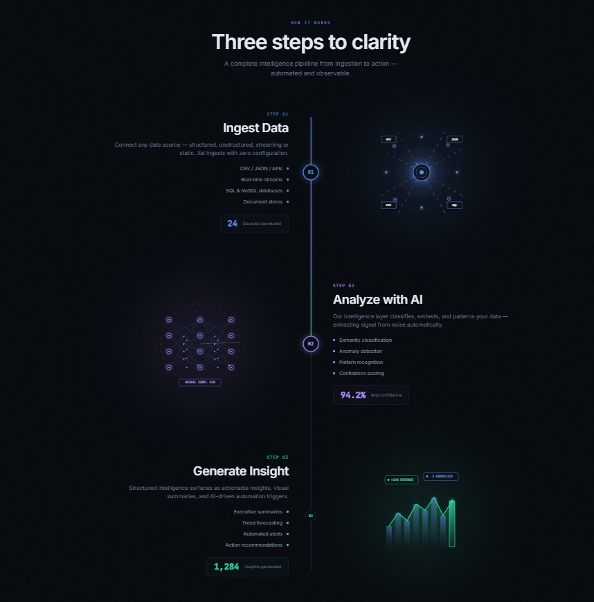
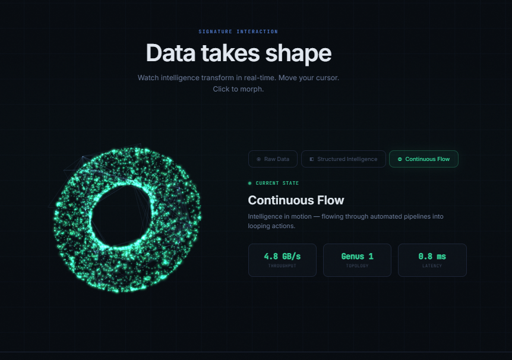

# Xai — Intelligence Workspace

> *From raw data → structured intelligence → actionable insight → AI Automations*

A high-fidelity, interactive product experience built for the RacoAI frontend engineering challenge. Designed and implemented to demonstrate UI/UX clarity, design-to-code execution, advanced motion & 3D interaction, and engineering discipline.

---

## 🔗 Project Links

* **Live Deployment URL:** [https://xai-workspace-ashik.vercel.app/](https://xai-workspace-ashik.vercel.app/)
* **Figma Design File URL:** [Figma Design Link](https://www.figma.com/design/53rFKPrnyBepeKGaJnFGmD/Xai---Intelligence-Workspace-%7C-UI-Design?node-id=0-1&t=YGEoz2VE7QuUN965-1)
* **GitHub Repository:** [https://github.com/Ashikur07/xai-workspace](https://github.com/Ashikur07/xai-workspace)

---

## 📸 Application Previews

| 🌌 3D Particle Hero Section | 📊 Intelligence SaaS Dashboard |
| :---: | :---: |
|  |  |
| **🌀 Interactive Pipeline Flow** | **🔮 Signature 3D Geometry Morph** |
|  |  |

---

## 🛠️ Technology Stack

| Layer | Technology | Rationale |
| :--- | :--- | :--- |
| **Framework** | **Next.js 14** (App Router, TS) | Production-ready routing, SSR performance, and clean directory structure. |
| **3D / WebGL** | **Three.js** + **React Three Fiber** | Custom vertex/fragment shader animations running on the GPU. |
| **Post-Process**| **@react-three/postprocessing** | Bloom filters for organic light emissions on vector cores. |
| **Animations** | **Framer Motion** | Declarative layout transitions, shared layout keys (`layoutId`), and UI orchestrations. |
| **Scroll Engine** | **GSAP** + **ScrollTrigger** | Precise ScrollTrigger hooks for pinning, direction checks, and sync. |
| **Smooth Scroll**| **Lenis Scroll** | Kinematics scroll interpolation for uniform feel across systems. |
| **Styling** | **Tailwind CSS** + Custom CSS | CSS custom properties, utility classes, and glassmorphic panels. |

---

## 🚀 Getting Started

To run the project locally, clone the repository and run the development server:

```bash
# Clone the repository
git clone https://github.com/Ashikur07/xai-workspace.git
cd xai-workspace

# Install dependencies
npm install

# Run the development server
npm run dev
```

Open [http://localhost:3000](http://localhost:3000) in your browser.

To build the production bundle:
```bash
npm run build
npm start
```

---

## 🎨 Interactive Sections & Key Features

### 1. Hero Section — Data → Intelligence
* **3D Particle Shader System:** A centerpiece WebGL `<Canvas>` rendering a 1,600-point particle field using a custom `ShaderMaterial`.
* **Scroll-Driven Morphing:** Points morph dynamically from an **abstract chaotic sphere distribution ↔ a structured 2D grid** based on viewport scroll progress (`uProgress`).
* **Mouse Repulsion Physics:** Custom GLSL logic pushes particles away from the cursor in real-time, creating a tactile "bubble" repulsion field.
* **Figma Headless Mode:** Passing `?export=true` freezes the particle field in its initial sphere layout, stops the drift clock, and hides floating icons to ensure pixel-perfect, uncropped vector screenshotting.

### 2. Interactive Insight Flow
* **Glowing Progress Timeline:** Explains the three stages (Ingest Data, Analyze with AI, Generate Insight) using a vertical alternating timeline with a glowing stream line linked to viewport scroll progress.
* **Custom SVG Visualizers:** No stock illustrations. Custom inline vector components feature continuous infinite CSS keyframe animations (pulsing data nodes, radar waves, data packets) that remain fluid in all states.
* **Headless Override:** When `export=true` is enabled, all stages are instantly fully visible (opacity 1.0, blur 0px) and the timeline progress line is set to 100% height to ensure clean capture.

### 3. Intelligence Dashboard Preview
* **High-Fidelity Mock UI:** A dark-themed SaaS console workspace featuring metrics count-up, sparkline charts, connected tables, action buttons, and switchable navigation tabs (Overview, Insights, Sources, Analytics, Pipeline).
* **Scroll Direction-Aware Animations:** 
  * *Scrolling Down:* Plays staggered entrance animations and delay transitions as elements enter the viewport.
  * *Scrolling Up:* Bypasses all delays/transitions to show fully loaded elements instantly, avoiding wiggles, flashes, or reset states.
* **Responsive Layouts:** The sidebar converts to a horizontal scrollable tab row on mobile, metric cards stack into 1-column layouts to give sparklines space, and tables are wrapped in scrollable containers to prevent overflow.

### 4. Signature Interaction (WOW Moment)
* **3D Geometry Morphing:** A Three.js custom vertex-colored shader that morphs particles between three mathematical forms:
  * **Sphere** (Raw Data)
  * **Cube** (Structured Intelligence)
  * **Torus** (Continuous Flow)
* **State Control & Parameter Sync:** Morphs can be triggered by clicking navigation buttons, clicking the WebGL canvas directly, or via an automated cycle.
* **URL Parameter Sync:** Pass URL parameters (e.g., `?tab=structured` or `?tab=1`) to load the corresponding tab state instantly on mount.
* **Subpixel Blur Fix:** Bypasses `y` translations in export mode to avoid WebKit GPU rendering bugs, ensuring 100% sharp text in Figma imports.

---

## 📈 Engineering Decisions & Architecture

```
                       ┌────────────────────────┐
                       │   Lenis Scroll Loop    │
                       └───────────┬────────────┘
                                   ▼
                       ┌────────────────────────┐
                       │ GSAP & ScrollTrigger   │
                       └───────────┬────────────┘
                                   ▼
          ┌────────────────────────┴────────────────────────┐
          ▼                                                 ▼
┌──────────────────┐                               ┌──────────────────┐
│   R3F Canvas     │                               │  Framer Motion   │
│ (uProgress Sync) │                               │  (Choreography)  │
└──────────────────┘                               └──────────────────┘
```

* **Zero-State Renders inside useFrame:** To maintain 60fps on high-resolution displays, all coordinates, mouse coordinates, and shader progress values flow through React **Refs** and update uniforms directly, bypassing React's reconciler/re-render cycles.
* **Separation of Concerns:** Component structure is highly modular. Mock database structures are separated in `lib/data.ts` and core easings/tokens are kept in `lib/constants.ts`.
* **Figma-to-Code Engineering:** The layout follows the exact margins, typography hierarchy (`Inter` + `JetBrains Mono` for data reading), and HSL tailormade colors defined in the Figma file.
